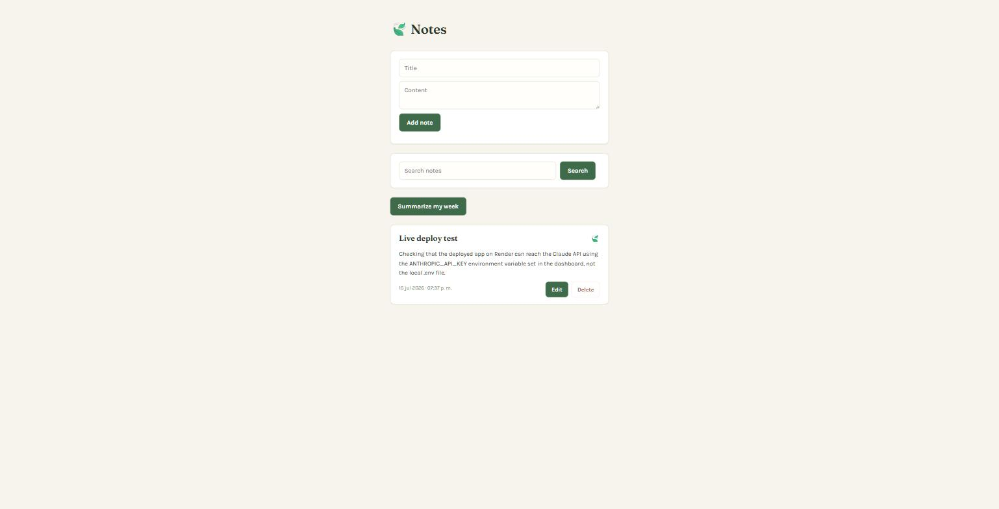

# Notes

A full-stack note-taking app with an AI-powered weekly summary feature, built with FastAPI, SQLite, and the Claude API.

**Live app:** https://note-app-a9kn.onrender.com/
**Repo:** https://github.com/Sergei1607/note-app



## What it does

- Create, edit, delete, and search notes (keyword search)
- **Summarize my week** — sends the last 7 days of notes to Claude and returns a short, plain-language summary of what you've been working on

## Tech stack

- **Backend:** FastAPI (Python), SQLite (parameterized queries, no ORM)
- **Frontend:** Vanilla HTML / CSS / JS, served directly by FastAPI's `StaticFiles`
- **AI:** [Anthropic's Claude API](https://www.anthropic.com), called from the backend via the official `anthropic` Python SDK — model: Claude Haiku, chosen for cost/latency over a heavier model since summarization doesn't need deep reasoning
- **Deployment:** Render (free tier)

## How the AI feature works

`GET /notes/summary` queries SQLite for notes created in the last 7 days. If there are none, it returns a canned message and skips the Claude call entirely — no need to pay for a request when the answer is already known. Otherwise, it builds a prompt from the notes (each note's content capped at ~2000 characters, so one unusually long note can't dominate the request or blow up cost), asks Claude for a plain-text summary with no markdown or emoji (the frontend has no markdown renderer, so asking the model to skip formatting up front was simpler than parsing it out after), and returns the result as JSON. The API call is wrapped in a `try/except` so a failed request returns a clean error instead of crashing the endpoint.

## Running it locally

```bash
git clone https://github.com/Sergei1607/note-app.git
cd note-app
python -m venv venv
source venv/bin/activate   # Windows: venv\Scripts\activate
pip install -r requirements.txt
```

Create a `.env` file in the project root with your own Anthropic API key:

```
ANTHROPIC_API_KEY=your-key-here
```

Then run:

```bash
uvicorn main:app --reload
```

The app will be available at `http://localhost:8000`.

## Known limitations

- **Notes don't persist across redeploys/restarts on the live version.** This is deployed on Render's free tier, which doesn't support persistent disks — the SQLite file lives on the container's filesystem and is wiped whenever the service redeploys, restarts, or spins down after 15 minutes of inactivity. For a real product this would need a hosted database (see below); for this project, the $0/month cost was worth more than persistence.
- No authentication — anyone with the link can read, write, and delete all notes.
- The "no markdown" instruction to Claude is a prompt-level request, not code-level enforcement — in rare cases the model could still return light formatting.

## What I'd improve next

- Swap SQLite for a hosted, persistent option (e.g. [Turso](https://turso.tech), which is SQLite-compatible and has a genuine free tier) so notes survive redeploys
- Add basic auth so the live demo isn't fully public-write
- Explore the other AI feature options considered for this project — auto-tagging notes on save, or semantic search via embeddings — as a second pass

## What this project demonstrates

Full CRUD over a real database, calling an external AI API from backend code (as opposed to using an AI coding assistant to *write* the code), prompt design for a specific output format and cost/latency tradeoff, and a real deployment with its own environment-variable and persistence constraints.
